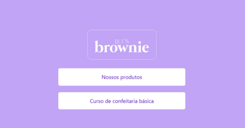
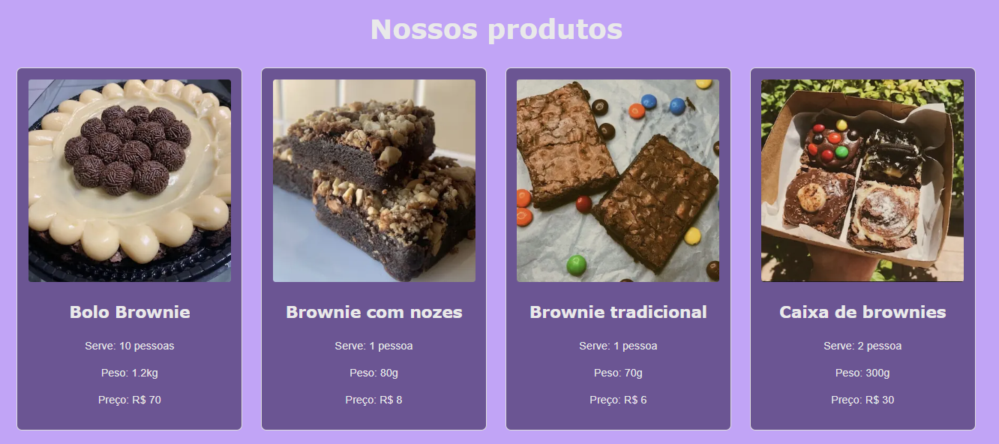
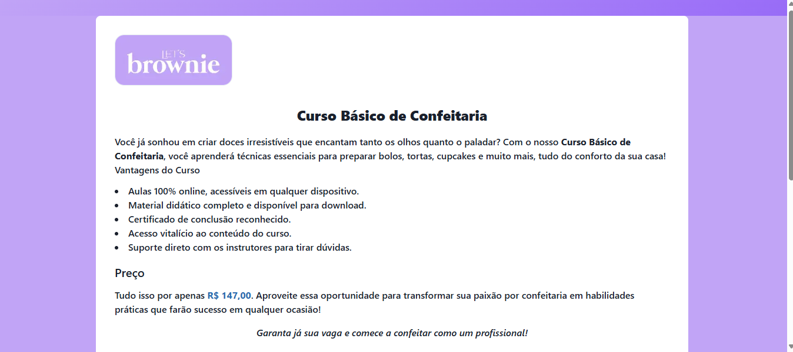
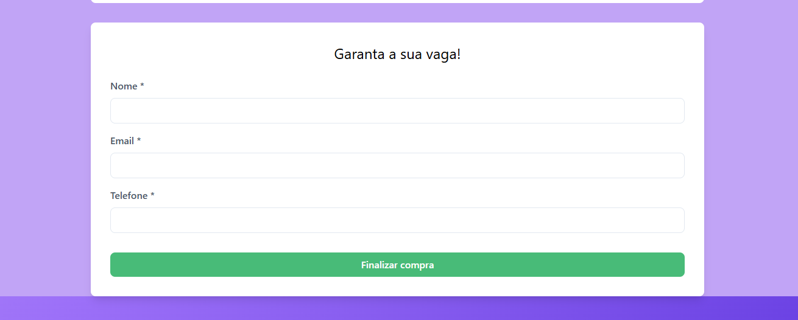

# 🍫 Let's Brownie


Esse projeto visa construir uma <strong>página de links para uma doceria,</strong> centralizando suas informações e maiores demandas para facilitar o acesso para seu público. Esse foi desenvolvido na matéria de <strong>Linguagem de Script</strong>, ministrada pelo professor Luiz Carlos e Francisco Dantas do curso de Sistemas para Internet do IFPB.


## 👀 Interfaces
### 🏠 Página Home
<div>

<br>

<p>Contém os elementos e seções principais da aplicação, sendo esses os seguintes <strong>botões<strong>:

-  `Nossos Produtos`: direciona à página de catálogo de produtos;
-  `Curso de confeitaria básica`: direciona à página de inscrição para um curso da marca. <p>
<div>
<hr>

### 🍰 Página Nossos Produtos
<div>

<br>

<p>Contém os produtos disponíveis no catálogo e suas respectivas <strong>informações</strong>, segundo exemplo:

-  `Imagem de produto`: bolo_brownie.jpg
-  `Nome do produto`: Bolo Brownie
-  `Serve`: 10 pessoas
-  `Peso`: 1.2 kg
-  `Preço`: R$ 70 <p>
<div>
    <hr>


### 📒 Página Curso de confeitaria básica
<div>



<br>

<p>Contém as informações do curso disponibilizado e um <strong>formulário</strong> com os seguintes campos:

-  `Nome`
-  `Email`
-  `Telefone`
<div>
    <br>

## 🚀 Instalação e execução
1. Clone e abra o projeto na sua IDLE:
    ```
    git clone https://github.com/leticiazlopes/letsbrownie-ls.git
    ```
    ```bash
    code . 
    ```
2. Instale as dependências:
    ```
    npm install
    ```
3. Rode o projeto:
    ```
    npm run dev
    ```
<br>

## 📂 Estrutura de pastas
```
src/
├── app/
│   ├── components-cards/
│   │   ├── App.jsx            
│   │   ├── Card.jsx          
│   │   ├── Produtos.jsx      
│   │   ├── style.css        
│   ├── components-curso/
│   │   ├── Body.jsx           
│   │   ├── Forms.jsx          
│   │   ├── Header.jsx         
│   │   ├── style.css          
│   ├── components-home/
│   │   ├── Body.jsx           
│   │   ├── Button.jsx         
│   │   ├── Header.jsx         
│   │   ├── style.css          
├── curso/
│   ├── page.js                
│   ├── produtos/
│   │   ├── page.js            
├── style/
│   ├── globals.css           
│   ├── index.css              
│   ├── layout.js             
├── supabase.js                
```


## 💻 Tecnologias utilizadas
[](https://github.com/leticiazlopes/letsbrownie-ls)


<br>


## 👥 Contribuidores
<table>
  <tr>
   <td align="center">
      <a href="https://github.com/leticiazlopes" title="gitHub">
        <br>
        <sub>
          <b>Letícia Lopes</b>
        </sub>
      </a>
    </td>
    <td align="center">
      <a href="https://github.com/lailaaquino" title="gitHub">
        <br>
        <sub>
          <b>Laila Aquino</b>
        </sub>
      </a>
    </td>
    <td align="center">
      <a href="https://github.com/suetonecarneiro" title="gitHub">
        <br>
        <sub>
          <b>Suetone Carneiro</b>
        </sub>
      </a>
    </td>
  </tr>
</table>
